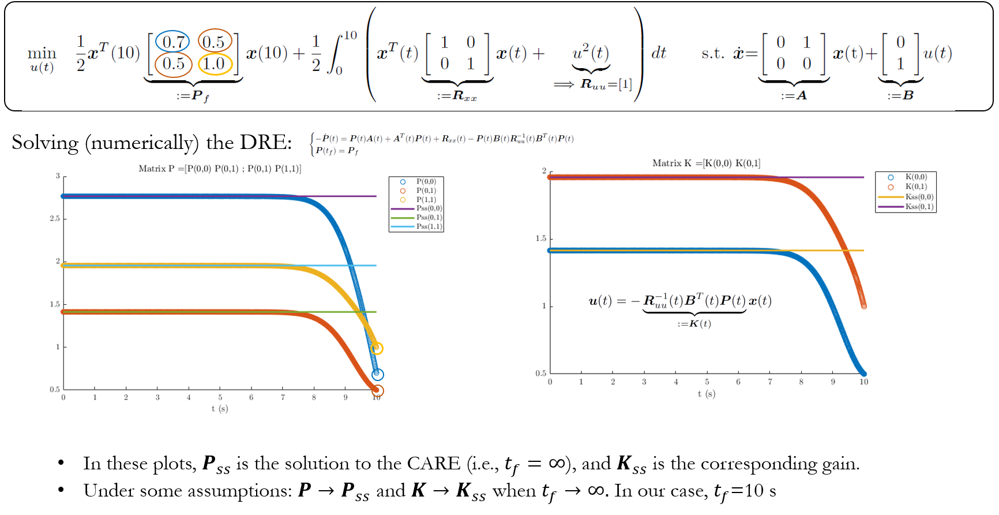

# Finite-horizon Continous LQR #

Simple example of the solution to the following problem:

 

The Differential Riccati Equation (DRE) is solved numerically. The infinite-horizon case (i.e., the Control Algebraic Riccati equation, CARE) is also solved in the code. 

# Instructions

Execute the MATLAB file. The result should look like this:

 
